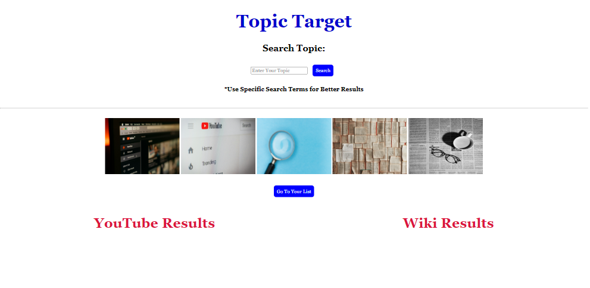

## Topic Target

# Description:

A single page search engine that allows the top ten results to be shown in article and video formats. Search for topics and get results with corresponding videos and articles displayed on page. Ability to save it to your list for viewing at a later time if desired.

# Usage:

From looking up a recipe with corresponding videos to getting info for a book report or reading articles and seeing the latest video updates about your favorite celebrity, Topic Target does it all for you on a single page!

Search for a topic and get the top ten results from both Wikipedia and YouTube displayed on the same page. No clicking back & forth between links, Ability to save to a favorites page for later viewing for each article and video result shown.

# Screenshots:

 

 

 

# Link to Finished Application:

[Topic Target Website](https://taajl.github.io/Topic-Target-/index.html{:target="_blank"})

# Technologies Used:

Wikipedia API 
YouTube API 
Skeleton CSS

# Credits:

Fon Jiamjan  
Taaj Logan  
Katie Alford

Pictures:
Patrick Tomasso  https://unsplash.com/photos/open-book-lot-Oaqk7qqNh_c{:target="_blank"}
 
Szabo Viktor  https://unsplash.com/photos/youtube-website-screengrab-4QmSdCP4bhM{:target="_blank"}
 
Markus Winkler  https://unsplash.com/photos/magnifying-glass-on-white-table-afW1hht0NSs{:target="_blank"}
 
Ashni Ahlawat  https://unsplash.com/photos/a-cup-of-coffee-and-a-pair-of-glasses-on-a-newspaper-Wh9ZC4727e4{:target="_blank"}
 
Christian Wiedigr  https://unsplash.com/photos/youtube-application-screengrab-NmGzVG5Wsg8{:target="_blank"}
